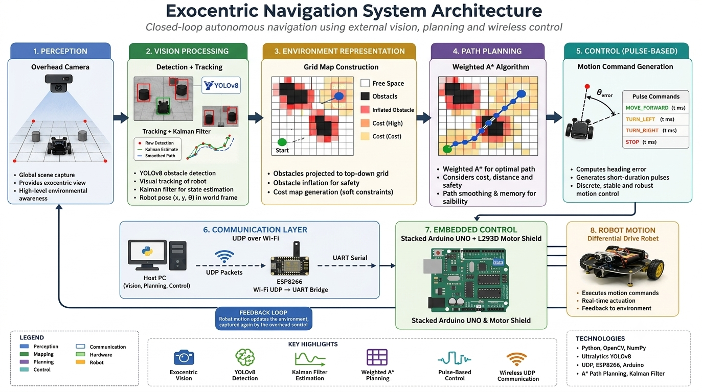
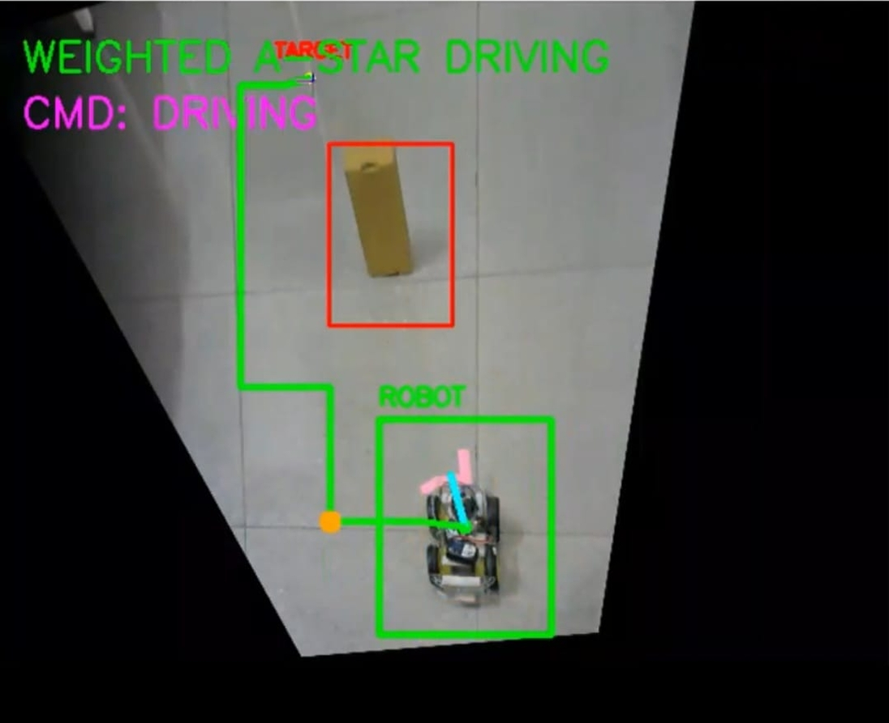
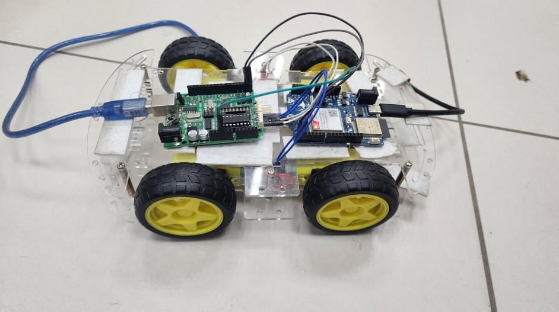

# Exocentric Navigation System

A real-time autonomous robotics system integrating computer vision, state estimation, path planning, and wireless embedded control for closed-loop navigation using an external perception framework.

---

# Problem Statement

Autonomous navigation on low-cost robotic platforms is constrained by limited onboard sensing, computational resources, and unreliable localization. Traditional onboard-only solutions often suffer from odometry drift, sensor noise, and the inability to run real-time deep learning models for perception and obstacle detection.

This project addresses these limitations by decoupling perception, planning, and control, shifting all computationally intensive tasks to an external host system. An overhead camera provides global environmental awareness, enabling accurate robot localization without relying on onboard SLAM or IMU-based estimation.

The system leverages centralized deep learning inference (YOLOv8) for real-time obstacle detection, converts detections into a grid-based environment representation, and performs weighted A* path planning for safe navigation. Motion commands are executed through a low-latency wireless communication pipeline, enabling real-time closed-loop control of the robot.

This architecture enables accurate global localization, robust obstacle-aware navigation, and computationally efficient real-time operation on resource-constrained robotic hardware.

---

# Project Motivation

Many educational and low-cost robotic platforms are constrained by limited onboard computation and sensing capabilities, making real-time autonomous navigation challenging. Rather than increasing onboard hardware complexity, this project explores an exocentric navigation paradigm in which perception, planning, and decision-making are performed externally while the robot acts as a lightweight execution platform.

This design demonstrates how distributed computation, computer vision, and embedded control can be integrated into a modular closed-loop navigation system capable of real-time autonomous operation.

---

# Abstract

This project presents a real-time autonomous robot navigation system that integrates computer vision, path planning, and wireless communication. The system uses an overhead camera to monitor the environment, where the robot is detected and tracked using motion detection, visual tracking, and filtering techniques. A Kalman filter is applied to improve the accuracy and stability of robot position estimation.

Obstacle detection is performed using a deep learning model based on YOLO, which identifies obstacles in the environment and maps them into a grid-based representation for efficient navigation.

A grid-based A* path planning algorithm computes the shortest and safest path from the robot’s current position to a user-defined target. Enhancements such as obstacle padding, soft constraints, and path memory are incorporated to ensure smooth and collision-free navigation.

The system employs pulse-based control, where short-duration movement commands are sent to the robot instead of continuous actuation signals. These pulses are generated based on real-time position and orientation feedback, improving stability and reducing overshooting.

Wireless communication is implemented using an ESP8266 module over UDP, which forwards commands to an Arduino microcontroller responsible for motor actuation.

The system demonstrates real-time performance in robot tracking, obstacle avoidance, and autonomous navigation, highlighting the integration of artificial intelligence, computer vision, and embedded systems into a unified robotic architecture.

---

# System Overview

The system is designed as a **closed-loop exocentric navigation pipeline**, where perception and decision-making are performed externally on a host machine.

### Core Pipeline

Camera → Vision Processing → State Estimation → Obstacle Mapping → Path Planning → Control → Wireless Execution → Robot Motion

---

# Key Features

- Exocentric (external camera-based) navigation architecture
- Real-time robot detection and tracking
- Kalman filter-based state estimation
- YOLOv8-based obstacle detection
- Grid-based environment representation
- Weighted A* path planning with cost penalties
- Obstacle inflation and soft constraints
- Path memory for trajectory smoothing
- Pulse-based motion control for stability
- UDP-based wireless communication pipeline
- ESP8266 → Arduino motor control bridge

---

# System Architecture

```
                +----------------------+
                |  Overhead Camera     |
                +----------+-----------+
                           |
                           v
              Vision Processing Pipeline
        (Detection + Tracking + Kalman Filter)
                           |
                           v
                Environment Representation
                 (Grid + Obstacles + Costs)
                           |
                           v
                   Path Planning Engine
                     (Weighted A*)
                           |
                           v
                    Motion Controller
            (Pulse-based command generation)
                           |
                           v
                  UDP Communication Layer
                           |
                     ESP8266 Bridge
                           |
                       UART Serial
                           |
                           v
                   Stacked Arduino UNO + L293D Shield
                           |
                           v
                      Differential Robot

```

### System Architecture (Visual)

The following diagram presents the complete closed-loop exocentric navigation pipeline implemented in this system, highlighting the stacked embedded control configuration:



---

# Design Philosophy

The system is intentionally designed as a distributed architecture to separate perception, planning, and actuation. This allows the computationally heavy vision and planning modules to run on a host machine while keeping the embedded controller lightweight and deterministic.

This separation improves:
- Real-time performance
- Modularity
- Fault isolation
- Scalability to multi-robot systems

---

# Key Engineering Decisions

Several architectural choices were intentionally made to balance computational efficiency and real-time performance.

- Deep learning inference is executed on the host computer rather than onboard the robot, allowing computationally intensive perception algorithms to run without exceeding embedded hardware limitations.

- UDP communication was selected to minimize communication latency between the host system and the robot, accepting occasional packet loss in exchange for faster control updates.

- A Kalman filter was used to improve robustness against noisy visual measurements and temporary tracking inaccuracies.

- Pulse-based motion control was adopted instead of continuous actuation to reduce overshoot and improve navigation stability on low-cost differential-drive hardware.

- Weighted A* planning was chosen because it provides deterministic, computationally efficient path generation while allowing safety-oriented cost penalties around detected obstacles.
 
---

# Repository Structure

```
vision/        → Homography, detection pipeline
tracking/      → Kalman filter, object tracking
planning/      → A* path planning, cost maps
control/       → State machine, motion control
comm/          → UDP communication and protocol handling
utils/         → Geometry and visualization tools
config/        → System configuration files
robot/         → ESP8266 and Arduino firmware
models/        → Trained YOLO weights

assets/        → Demo media (images, videos, GIFs)
docs/          → Technical report and architecture diagrams

main.py        → Application entry point
requirements.txt → Python dependencies
.gitignore
LICENSE
README.md
```

---

# Hardware Architecture

- **Robot Platform:** Stacked Arduino UNO + L293D Shield
- **Communication:** ESP8266 (Wi-Fi UDP → Serial bridge)
- **Compute:** Host PC (Python-based vision + planning)
- **Sensor:** Overhead monocular camera

**Hardware Iteration Note:**  
During early prototyping, a LILYGO T-A7672S board (ESP32 + SIMCom A7672S LTE module) was used for testing communication and system integration.  

The final implementation uses an ESP8266 module as a lightweight Wi-Fi UDP bridge between the host system and Arduino, chosen for its simplicity, sufficient performance, and lower system overhead.

**System Consistency Note:**  
The repository codebase corresponds to the final implementation using ESP8266 as the Wi-Fi communication bridge. Earlier prototyping used a different hardware setup, but all current scripts, firmware, and communication logic are aligned with the ESP8266-based system.

---

# Software Stack

- Python (core system)
- OpenCV (vision pipeline)
- NumPy (numerical computation)
- Ultralytics YOLOv8 (object detection)
- Arduino IDE (motor control firmware)
- ESP8266 Wi-Fi firmware

**Embedded Firmware:**
- C++/Arduino Core
- SoftwareSerial Library (Inter-board UART bridge)
- Motor_Shield Library (Provides the DCMotor abstraction for controlling the L293D motor driver)

---

# Installation

```bash
git clone https://github.com/<your-username>/exocentric-navigation-systems.git
cd exocentric-navigation-systems
python -m pip install -r requirements.txt
```

---

# Execution

1. Flash ESP8266 and Arduino firmware from `/robot`
2. Connect system to Wi-Fi network
3. Update ESP8266 IP in `config/settings.py`
4. Run:

```bash
python main.py
```

5. Calibrate using four-point homography selection
6. Press **SPACE** to initialize robot orientation calibration
7. Click target location for autonomous navigation

---

# Core Algorithms

### 1. Homography Transformation
Maps perspective view into a top-down coordinate system.

### 2. Kalman Filtering
Reduces noise in visual tracking and stabilizes state estimation.

### 3. YOLOv8 Detection
Detects obstacles and converts them into spatial grid constraints.

### 4. Weighted A*
Computes optimal path considering obstacle density and safety margins.

### 5. Pulse-Based Control
Transforms continuous motion into discrete stable movement commands.

---

# Engineering Highlights

- Modular multi-layer architecture (vision → planning → control)
- Distributed computation between PC and embedded systems
- Real-time perception-to-action loop
- Robust tracking with sensor fusion principles
- Hybrid classical + deep learning robotics pipeline
- Networked robot control using UDP protocol

---

# Limitations

Like most vision-based autonomous navigation systems, the current implementation makes several design assumptions:

- **Overhead Camera Requirement:** The system relies on a fixed overhead camera to obtain a global view of the environment. Navigation accuracy depends on maintaining sufficient camera headroom and an unobstructed field of view.

- **Homography-Based Workspace:** Robot localization is performed using a manually calibrated homography transformation. Significant camera movement or changes in the workspace require recalibration.

- **Known Obstacle Classes:** Obstacle avoidance is limited to object categories that are recognized by the trained YOLOv8 detection model. Previously unseen obstacle classes may not be incorporated into the navigation map.

- **Single-Robot Operation:** The current architecture is designed for a single mobile robot and does not include multi-robot coordination or cooperative path planning.

- **Static Planning Environment:** Path planning assumes that obstacle locations remain relatively stable during navigation. Highly dynamic environments may require continuous replanning and more advanced prediction techniques.
 
---

# Future Improvements

- ROS2 migration
- Multi-robot coordination
- Multi-camera fusion
- SLAM-based mapping
- GPU-accelerated inference
- Reinforcement learning-based navigation

---

# Results

The implemented system successfully demonstrates:

- Real-time robot localization using overhead vision
- Robust visual tracking with Kalman filter state estimation
- Real-time obstacle detection using a custom YOLOv8 model
- Weighted A* path planning with obstacle inflation and path smoothing
- Autonomous navigation to user-selected destinations
- Low-latency wireless control using an ESP8266 UDP communication bridge

### Autonomous Navigation

The figure below shows the complete navigation pipeline during runtime. The system simultaneously performs robot localization, obstacle detection, path planning, and closed-loop control while navigating toward the selected destination.



---

# Demonstration

### Autonomous Navigation Demo


The animation demonstrates the complete perception-to-action pipeline, including robot tracking, obstacle detection, weighted A* path planning, and autonomous target reaching.

### Hardware Platform



### Technical Report

A detailed implementation report is available here:

📄 [Technical Report (PDF)](docs/Final_ENDTERM_REPORT.pdf)

### Full Demonstration Video

A complete demonstration, including multiple autonomous navigation runs, is available here:

▶️ [Full Demonstration Video (MP4)](assets/robot_demo.mp4)

---

# License

MIT License
